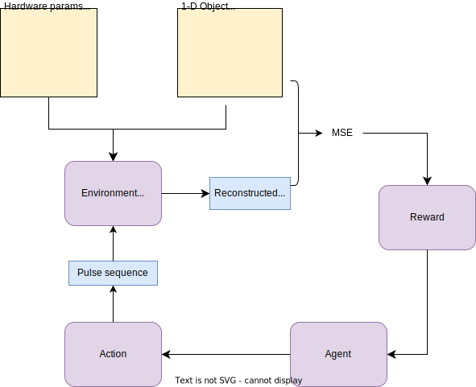
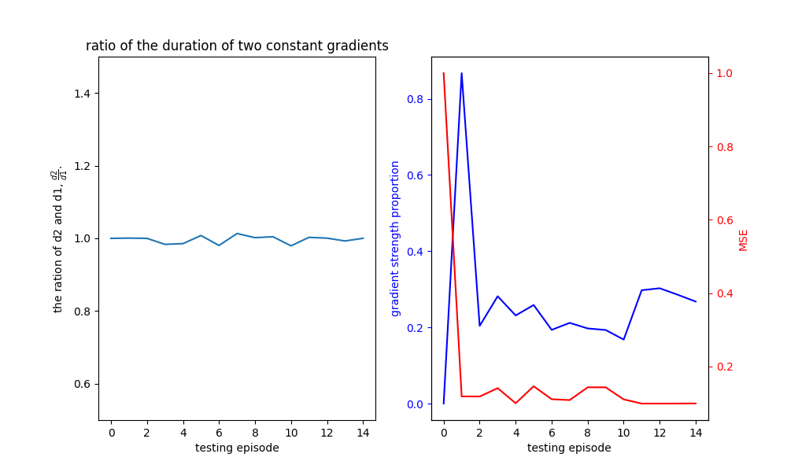

# Optimization of MRI Pulse Sequence by Reinforcement Learning.

This repository contains the code and report for my master thesis *Optimization of MRI Pulse Sequence by Reinforcement Learning*. This project focus on the optimization of gradient-echo sequences for 1-D objects using the Deep Deterministic Policy Gradient (DDPG) algorithm under constraints on gradient slew rate.

<div style="text-align:center;">
  
  <p><em>A 1D imaging protocol for a gradient echo sequence structure.</em></p>
</div>

<div style="text-align:center;">
  
  <p><em>Schematic of the DDPG framework.</em></p>
</div>

<div style="text-align:center;">
  
  <p><em>Actions and corresponding error in testing episodes for 1-D object.</em></p>
</div>

## Dependencies
```
pip install -r requirements.txt
```
## DDPG model
1. Modify the target object in the `env.py` file.
```python
self.density = np.zeros(len(self.x_axis)) # target object
```
2. Modify the arguments in the `main.py` file.
3. Run the `main.py` file.
```script
python main.py
```
4. output of model and best action for each testing episode will be saved in the `./src/Training/{datetime}` folder by default.

## MR signal simulator
- run the `./src/simulator.ipynb' file to simulate the MR signal of the target object.